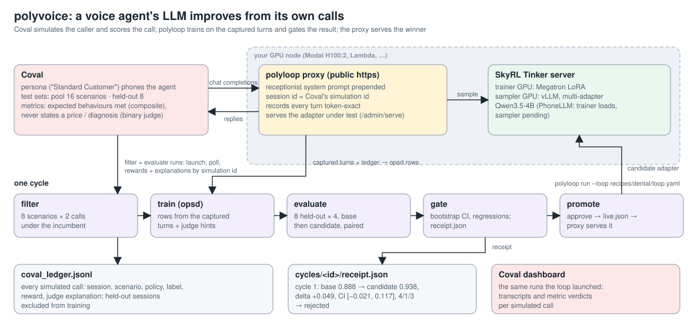
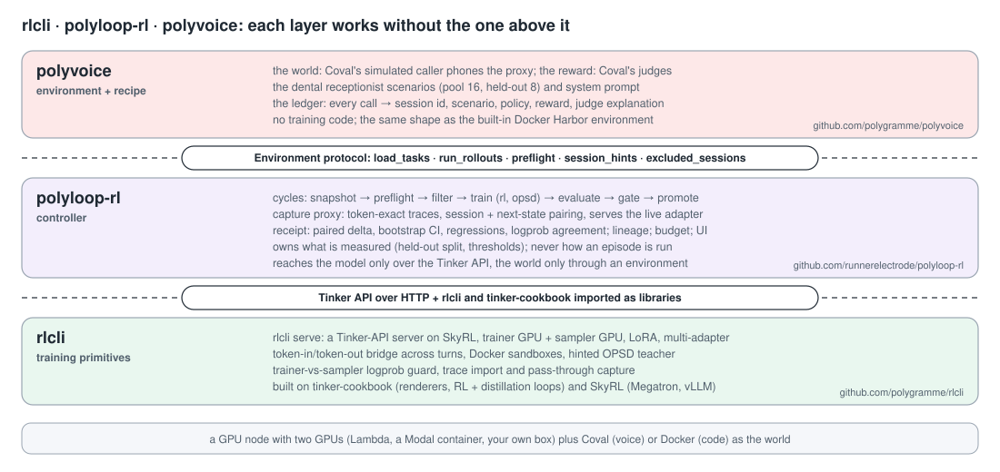

# polyvoice

A voice agent's language model that improves from its own calls. polyvoice is a recipe package for
[polyloop-rl](https://github.com/runnerelectrode/polyloop-rl): it plugs [Coval](https://coval.ai)
into the loop as the environment and the verifier, so the cycle polyloop already runs for coding
agents (snapshot, preflight, filter, train, evaluate, gate, promote) runs for the LLM inside a
phone receptionist.



What lives here and not in polyloop: the Coval client, the ledger that joins every simulated
conversation to its score and the judge's explanation, the environment that maps a Coval run
onto polyloop's rollout contract, a CLI to check the account and seed test sets, and the
`dental` recipe (a receptionist system prompt, 16 pool scenarios, 8 held-out scenarios).

Status: **v0; two full cycles ran on 2026-09-18, and the second one earned a promotion.** On PhoneLLM Alpha 1
(Daily's phone-agent SFT of Nemotron 3 Nano 30B-A3B) one OPSD cycle on 16 of its own simulated calls lifted the
8 held-out scenarios from 0.875 to 0.953, delta +0.078 with a 95% CI of [+0.031, +0.125], 5 wins / 0 losses / 3
ties, all gate checks passing; see [`docs/RESULTS.md`](docs/RESULTS.md). The earlier 4B cycle: Qwen3.5-4B on the `dental` recipe, Coval
simulating the caller, 82 simulated conversations: base 0.888 vs candidate 0.938 on the 8 held-out
scenarios × 4 repeats, paired delta +0.049 with a 95% CI of [−0.021, +0.117], 4 wins / 1 loss / 3 ties.
The gate rejected it (a hair under the 0.05 minimum), which is the right call on 8 scenarios. Receipt
and per-step metrics in [`docs/RESULTS.md`](docs/RESULTS.md). What the run confirmed: Coval's
judge values parse (the binary judge returns "YES"/"NO"), the proxy's session id equals the id Coval
reports scores under, so judge explanations join the right training rows, and held-out sessions never
reach training. Run on a Modal H100:2 container with the proxy published through Modal's port forward;
the same recipe runs on any GPU box with a public https URL for the proxy.

## Where polyvoice sits



polyvoice contains no training code. It implements polyloop's five-method Environment protocol
(`load_tasks`, `run_rollouts`, `preflight`, `session_hints`, `excluded_sessions`) on top of Coval's API:
a task is a Coval test case, K episodes are one Coval run with `iteration_count=K`, the reward is the mean
of the configured metrics, and the judges' explanations flow back to polyloop as hindsight hints keyed by
session id. polyloop does the rest exactly as it does for a coding agent: builds OPSD rows from the
proxy's token-exact traces, trains a LoRA through rlcli's server, evaluates candidate against incumbent on
the frozen held-out scenarios, and writes the receipt. The proxy serves whichever adapter won; Coval's
agent configuration never changes. The longer walkthrough is in polyloop-rl's README under "How the
pieces fit".

## What Coval does in this loop, and what it must not

- **Held-out gate and filter**: a run = agent × persona × test set, `iteration_count` = K. Each
  simulation reports its `test_case_id`, so polyloop's paired receipt works unchanged.
- **Hindsight for OPSD**: the judges' explanations of failed conversations become the hint the
  teacher sees; the student re-samples the same turns on policy.
- **Never the RL rollout engine.** Every simulation is a real-time conversation billed in
  simulation minutes (Starter: 100 min/month, $0.40/min over, 5 concurrent; Growth: 1,000 min,
  25 concurrent). This recipe is OPSD-only for that reason. RL rollouts belong in a text sandbox
  with a persona LLM and ASR-noise injection, see `docs/PLAN.md`.

Per cycle as shipped: filter 8 scenarios × 2 = 16 conversations, gate 8 × 4 × 2 policies = 64.

## Setup

On the GPU node (polyloop's `scripts/node_up.sh` brings the server up), plus:

```bash
uv pip install -e .                         # pulls polyloop-rl at the pinned ref
export COVAL_API_KEY=...                    # never in the recipe

# 1. the proxy Coval will call, with the receptionist prompt prepended to every conversation
polyloop proxy --loop recipes/dental/loop.yaml --host 0.0.0.0 --port 8787 --system-prompt recipes/dental/system.md
cloudflared tunnel --config /dev/null --protocol http2 --url http://127.0.0.1:8787   # https URL -> environment.options.public_url
# (on Lambda nodes the default config file belongs to their JupyterLab tunnel; on Modal use modal.forward and bind the proxy to 0.0.0.0)
# optional second instance so production traffic stays on the live adapter while a candidate is scored:
polyloop proxy --loop recipes/dental/loop.yaml --port 8788 --slot candidate --system-prompt recipes/dental/system.md

# 2. test sets (free), agent and persona ids
polyvoice account                                                        # what the account has
polyvoice seed --test-set NEW:dental-pool    --file recipes/dental/scenarios-pool.json
polyvoice seed --test-set NEW:dental-holdout --file recipes/dental/scenarios-holdout.json
# in the Coval UI: a MODEL_TYPE_CHAT agent (any endpoint; polyvoice re-points a copy), and the
# metrics: a composite from expected behaviours + one binary judge ("never states a price").
# Fill agent_id, persona_id, metric_ids, public_url and the two coval:// datasets in loop.yaml.

# 3. check without spending, then run
polyvoice check --loop recipes/dental/loop.yaml
polyloop run    --loop recipes/dental/loop.yaml
polyvoice ledger --loop recipes/dental/loop.yaml --failed
```

The agent registered on Coval is a duplicate of `agent_id` pointed at `<public_url>/v1/chat/completions`
with `X-Session-Id: {{simulation_output_id}}`, so each conversation's trace is keyed by the id Coval
reports scores under. Before each rollout the environment tells the proxy which adapter to serve
(`POST /admin/serve`, never `live.json`) and clears it afterwards.

## Layout

```
polyvoice/
  coval/client.py    v1 API: test cases, agents (duplicate + endpoint), runs, simulations, metric outputs, conversations:submit
  coval/rewards.py   reward = mean of metric values, judge explanations, ledger, session hints, holdout exclusions
  envs/coval.py      CovalEnvironment: polyloop's Environment protocol on Coval runs
  cli.py             polyvoice account | check | seed | ledger
recipes/dental/      loop.yaml, system.md, scenarios-pool.json, scenarios-holdout.json, program.md
tests/               fake Coval in the live API's shapes; the polyloop runner driven end to end
docs/PLAN.md         the full voice loop plan (sandbox rollouts, production scoring, model choice)
docs/RESULTS.md      cycle receipts; scripts/arch_diagram.py renders docs/architecture.svg
```

## License

Apache-2.0.
